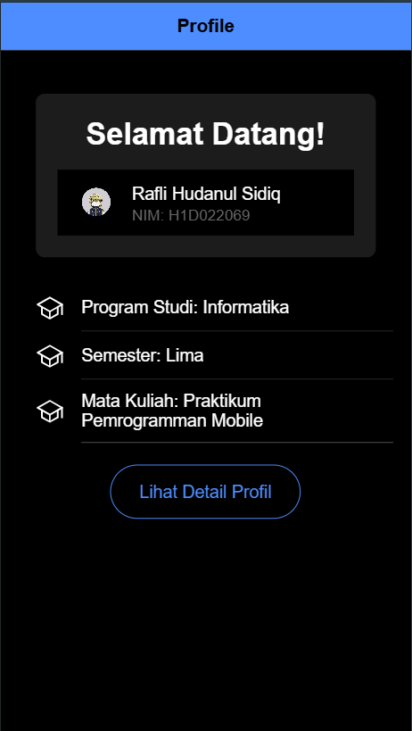
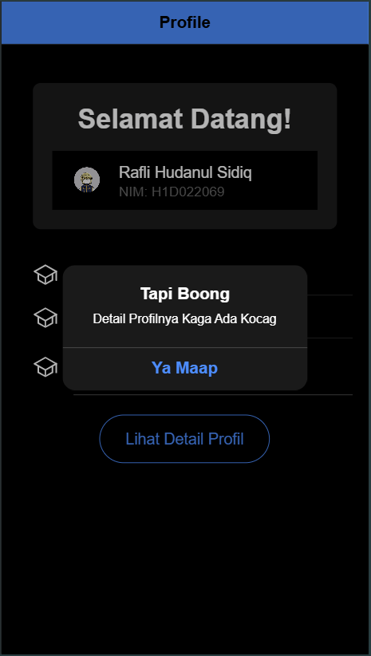

Berikut adalah penjelasan untuk menambahkan komponen di halaman Ionic yang dapat Anda masukkan dalam README.md:

---

## Cara Menambahkan Komponen di Halaman Ionic

### 1. **Buka Halaman yang Akan Ditambahkan Komponen**
   - Pastikan Anda sudah membuat halaman yang diinginkan menggunakan Ionic CLI dengan perintah:
     ```bash
     ionic generate page NamaHalaman
     ```
   - Ini akan membuat direktori baru untuk halaman tersebut di dalam folder `src/app/`.

### 2. **Import Komponen yang Diperlukan**
   - Ionic menyediakan berbagai **UI Components** yang bisa digunakan langsung dengan tag HTML mereka. Pastikan Anda memeriksa dokumentasi komponen di [Ionic Framework Documentation](https://ionicframework.com/docs/components) untuk detail komponen.

### 3. **Tambahkan Komponen ke Template Halaman**
   - Buka file HTML halaman yang Anda buat (biasanya `nama-halaman.page.html`).
   - Gunakan tag komponen Ionic sesuai dengan kebutuhan. Misalnya, untuk menambahkan tombol, Anda bisa menambahkan tag `<ion-button>`:
     ```html
     <ion-button color="primary">
       Klik Saya
     </ion-button>
     ```
   - Komponen lain seperti form, card, atau list juga dapat ditambahkan dengan cara yang serupa. Lihat contoh berikut:
     ```html
     <ion-card>
       <ion-card-header>
         <ion-card-title>Judul</ion-card-title>
       </ion-card-header>
       <ion-card-content>
         Isi dari card ini.
       </ion-card-content>
     </ion-card>
     ```

### 4. **Customisasi Komponen**
   - Anda dapat menambahkan atribut ke setiap komponen Ionic untuk mengubah tampilan dan perilakunya. Misalnya, untuk mengubah warna tombol, tambahkan atribut `color` atau `expand` pada komponen `<ion-button>`:
     ```html
     <ion-button color="danger" expand="full">
       Hapus
     </ion-button>
     ```

### 5. **Jalankan Aplikasi untuk Melihat Hasil**
   - Setelah menambahkan komponen, jalankan aplikasi Anda untuk melihat hasilnya:
     ```bash
     ionic serve
     ```

---

Langkah-langkah ini memberikan panduan sederhana dan cepat untuk menambahkan komponen dalam halaman Ionic dan meng-customize tampilannya dengan berbagai properti yang tersedia.
